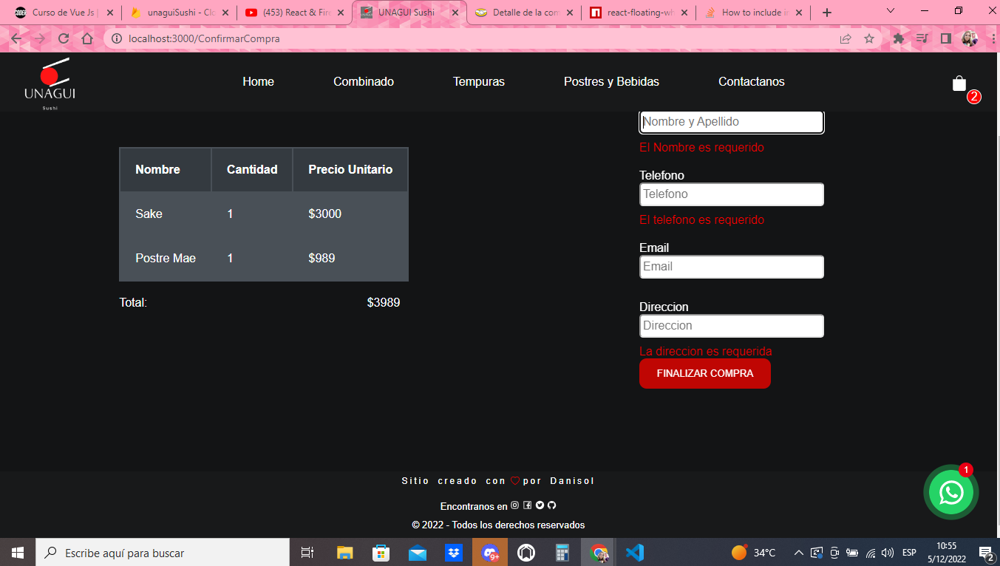
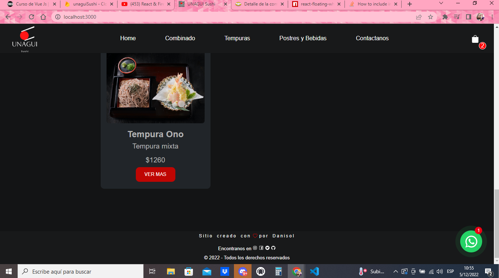

# App UnaguiSushi :sushi:

hola soy Daniela Reta docente de Nivel Inicial hace mas de 15 años y actualmente estudiante de Programación hace un año. En este primer acercamiento a la programacion tiene una inclinacion al Frontend. se pueden visualizar algunos de mis trabajos en mi cuenta de GitHub [Danisole](https://github.com/Danisole)

El objetivo de esta app es poder mostrar de manera elegante un E-commerce realizado con React libreria de JS.
En este proyecto se priorizo la funcionalidad haciendolo amigable y ordenado para el usuario con un estilo sobrio para su mayor usabilidad y se paso por los filtros de accesiblidad para cuidar ese detalle.
el proyecto se confecciono de tal manera que fuera escalable en el tiempo y siga pudiendose perfeccionar a medida que se adquieran mas conocimientos.
En este poyecto se uso para su confeccion el editor de codigo Visual Studio Code 

####Tecnologias Utilizadas:

        
Como editor para el estilado de toda la aplicacion

## Instalación :gear:

Para su uso lo primero que deberiamos hacer es dirigirnos al  [Repo](https://github.com/Danisole/finalcoder.git) donde se encuentra alojado el repositorio.

### Pasos a seguir :clipboard:

1. Dirigirnos a GitHube 
1. En el margen derecho superior clickear [<>Code] donde se despliega un menu.
1. El menu desplegable contiene la direccion de GitHub con el icono para copiarla.
1. Copiamos el link para luego clonar el repositorio en nuestro equipo:
   * Abrir el editor de tu preferencia (personalmente mi favorito es VSC)
   * Crear un proyecto donde alojaremos nuestro repositorio clonado
   * Desde la consola accedemos a Git Bash ahi colocamos los comandos "git clone" + el  link copiado, esperamos que descargue el proyecto para luego comenzar a usarlo.

1. Realizados los pasos anteriores debemos proceder a instalar las dependencias correspondientes para su correcto uso:
Esto se realiza mediante el comando `npm install` :hammer_and_wrench:

*   "@testing-library/jest-dom": "^5.16.5",
*    "@testing-library/react": "^13.4.0",
*    "@testing-library/user-event": "^13.5.0",
*    "firebase": "^9.14.0",
*    "framer-motion": "^7.6.7",
*   "react": "^18.2.0",
*   "react-copy-to-clipboard": "^5.1.0",
*   "react-dom": "^18.2.0",
*   "react-floating-whatsapp": "^5.0.7",
*   "react-hook-form": "^7.40.0",
*   "react-icons": "^4.6.0",
*   "react-router-dom": "^6.4.2",
*    "react-scripts": "5.0.1",
*   "react-toastify": "^9.1.1",
*   "styled-components": "^5.3.6",
*   "web-vitals": "^2.1.4"

1. El listado anterior corresponde a los paquetes usados en este proyecto cada uno con su finalidad especifica y sin estar sobrecargado para priorizar el codigo limpio y ordenado.

## Detalle de los paquetes intalados para este proyecto :book:

A continuación se realizara una breve explicacion de los paquetes instaldos y su funcionalidad

*   "firebase": "^9.14.0": Firebase se uso para alojar el array de productos, cumple la función de base de datos en el proyecto y se instalo a traves del comando `npm install firebase` y crearemos en la pagina nuestra base de datos. [Firebase](https://firebase.google.com/?hl=es-419)

*   "react-copy-to-clipboard" se uso para darle la opcion de copiado a los usuarios del proyecto y asi poder conservar el numero de orden de la compra. Se uso el comando para la instalacion `npm i react-copy-to-clipboard` para luego importarse a travez de `import { CopyToClipboard } from 'react-copy-to-clipboard'` donde estaria listo para su uso. [ React copy to clipboard](https://www.npmjs.com/package/react-copy-to-clipboard)

*   "react-icons": "^4.6.0" Este paquete se instalo para tener acceso a una amplia galeria de iconos usados en las diferentes partes del proyecto para identificar funcionalidades no solo a traves de la palabra escrita sino de los simbolos que caracterizan el metalenguaje.
La instalacion se realizo a traves del comando `npm install react-icons --save ` y luego debe importarse en la seccion donde queramos usarla. [React-icons](https://react-icons.github.io/react-icons).

*   "react-router-dom": "^6.4.2" Este paquete se instalo para agilizar y optimizar las prestaciones que tiene la navegabilidad entre componentes ya que permite recorrer esas rutas sin necesidad de renderizar todo el documento. La instalación se realizo a traves del comando `npm i react-router-dom` para luego seguir la documentacion para implementarla [React-router-DOM](https://reactrouter.com/)

*   "styled-components": "^5.3.6" paquete usado para darle estilo a la pagina fue mi eleccion ya que siento la necesidad de tener menos productos prearmados y podes darle estilos mas propios. La instalacion se realiza con `npm install --save styled-components` y para acceder a su documentacion para implementarla seguir [Styled-components](https://styled-components.com/)

*   "react-floating-whatsapp" este paquete fue usado para crear la opcion de comunicarse por whatsapp con el usuario y asi poder tener una comunicacion mas fluida este boton se instalo a travez `npm i react-floating-whatsapp` y se importa al componente App a traves del comando `import { FloatingWhatsApp } from 'react-floating-whatsapp'` y desde ahi incorporamos en el return `<FloatingWhatsApp {/*  Props  */} />`donde podremos personalizar el boton y sus funciones.[React Floating Whatsapp](https://www.npmjs.com/package/react-floating-whatsapp)

*   "react-toastify" paquete usado para mostrar notificaciones en tiempo real y asi poder guiar al usuario en las funciones, a pesar de ser la pagina intuitiva esto se usa para una mejor eperiencia y que asi tenga la confirmacion de lo que esta realizando. Se instalo a travez del comando `npm i react-toastify` se coloca en App el comando ` import { ToastContainer, toast } from 'react-toastify' y 'import 'react-toastify/dist/ReactToastify.css'` y en cada seccion donde queramos usarlo hay que importar `import { toast } from 'react-toastify'` podemos revisar la documentacion para personalizar nuestras notificaciones en [React Toastify](https://www.npmjs.com/package/react-toastify) 

### El deploy de la app se realizo a traves de Vercel conectado con gitHub  [Unagui Sushi](https://finalcoder.vercel.app/) :sushi:

Imagenes representativas del proyecto :camera: :

.png)

.png)

.png)

.png)

.png)

# Getting Started with Create React App

This project was bootstrapped with [Create React App](https://github.com/facebook/create-react-app).

## Available Scripts

In the project directory, you can run:

### `npm start`

Runs the app in the development mode.\
Open [http://localhost:3000](http://localhost:3000) to view it in your browser.

The page will reload when you make changes.\
You may also see any lint errors in the console.

### `npm test`

Launches the test runner in the interactive watch mode.\
See the section about [running tests](https://facebook.github.io/create-react-app/docs/running-tests) for more information.

### `npm run build`

Builds the app for production to the `build` folder.\
It correctly bundles React in production mode and optimizes the build for the best performance.

The build is minified and the filenames include the hashes.\
Your app is ready to be deployed!

See the section about [deployment](https://facebook.github.io/create-react-app/docs/deployment) for more information.

### `npm run eject`

**Note: this is a one-way operation. Once you `eject`, you can't go back!**

If you aren't satisfied with the build tool and configuration choices, you can `eject` at any time. This command will remove the single build dependency from your project.

Instead, it will copy all the configuration files and the transitive dependencies (webpack, Babel, ESLint, etc) right into your project so you have full control over them. All of the commands except `eject` will still work, but they will point to the copied scripts so you can tweak them. At this point you're on your own.

You don't have to ever use `eject`. The curated feature set is suitable for small and middle deployments, and you shouldn't feel obligated to use this feature. However we understand that this tool wouldn't be useful if you couldn't customize it when you are ready for it.

## Learn More

You can learn more in the [Create React App documentation](https://facebook.github.io/create-react-app/docs/getting-started).

To learn React, check out the [React documentation](https://reactjs.org/).

### Code Splitting

This section has moved here: [https://facebook.github.io/create-react-app/docs/code-splitting](https://facebook.github.io/create-react-app/docs/code-splitting)

### Analyzing the Bundle Size

This section has moved here: [https://facebook.github.io/create-react-app/docs/analyzing-the-bundle-size](https://facebook.github.io/create-react-app/docs/analyzing-the-bundle-size)

### Making a Progressive Web App

This section has moved here: [https://facebook.github.io/create-react-app/docs/making-a-progressive-web-app](https://facebook.github.io/create-react-app/docs/making-a-progressive-web-app)

### Advanced Configuration

This section has moved here: [https://facebook.github.io/create-react-app/docs/advanced-configuration](https://facebook.github.io/create-react-app/docs/advanced-configuration)

### Deployment

This section has moved here: [https://facebook.github.io/create-react-app/docs/deployment](https://facebook.github.io/create-react-app/docs/deployment)

### `npm run build` fails to minify

This section has moved here: [https://facebook.github.io/create-react-app/docs/troubleshooting#npm-run-build-fails-to-minify](https://facebook.github.io/create-react-app/docs/troubleshooting#npm-run-build-fails-to-minify)
# finalcoder
